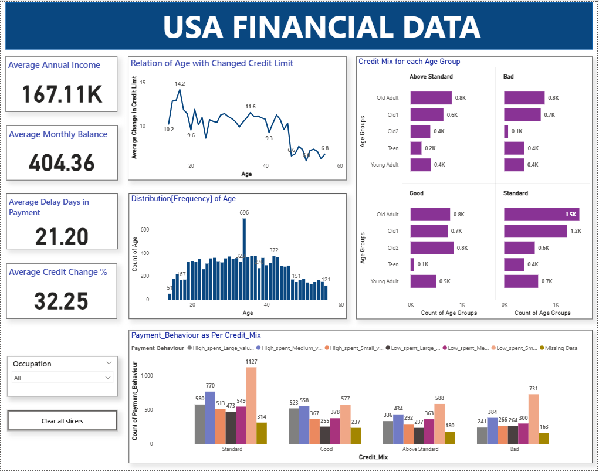
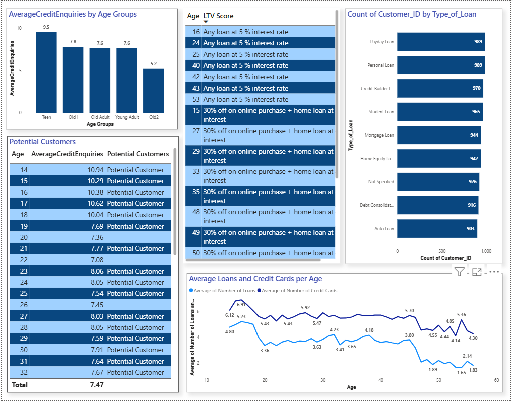

markdown
# USA Financial Data Automation Cleaning Dashboard 

## 📌 Problem Statement
We were facing significant inefficiencies in our financial data analysis process for the USA survey data:

- **Time Consumption**: Collecting, merging, and cleaning ~25 files daily took hours.
- **Increased Costs**: Hiring 2 additional employees to manage this process cost $12,000/month.
- **Error Rates**: Manual handling introduced frequent data errors.
- **Workload Impact**: The delay and extra work affected other projects.

### Existing Manual Process
1. Download files from Outlook emails.
2. Combine into a single dataset.
3. Clean and prepare data.
4. Build dashboard for reporting.
5. Share results with the US Government.

---

## 🚀 Automated Solution

To address these challenges, I automated the workflow using the following tools:

- **Power Automate**: Automatically moves Outlook email attachments to Google Drive.
- **Google Drive API + Python**: Automatically fetches daily files and loads them into Power BI.
- **Power Query Editor**: Cleans and transforms the data within Power BI.
- **Power BI Dashboard**: Visualizes the results and updates daily.

**Impact of Automation:**
- Processing time reduced drastically.
- Zero manual file handling.
- Reduced operational cost (no need for extra hires).
- Improved accuracy and consistency.
- Eliminated $12,000/month additional labor costs
- Improved overall workflow efficiency
---

## 📊 Dashboard Previews

### Dashboard 1

### Dashboard 2

---

## 🔍 Analytical Queries & Insights Delivered

1. **Key Metrics Display**:
   - Average Annual Income
   - Average Monthly Balance
   - Average Delay Days in Payment
   - Average Credit Change %

2. **Credit Limit Analysis**:
   - Investigate relationship between age and changes in credit limit.
   - Compare payment behaviour across credit mix categories.

3. **Customer Age Distribution**:
   - Frequency distribution of age demographics.

4. **Credit Mix vs Age Groups**:
   - Age groups:  
     - 14–19: Teen  
     - 19–25: Young Adult  
     - 25–35: Old Adult  
     - 35–45: Old1  
     - > 45: Old2  
   - Count of people with different credit scores for each group.

5. **Payment Behaviour Trends**:
   - Frequency of payment behaviours within each credit mix.

6. **Potential Customer Identification**:
   - Age groups likely to take loans.

7. **High Inquiry Potential Customers**:
   - Ages with average credit inquiries > 7.5.

8. **LTV Score Calculation & Promotions**:
   Promotions based on LTV:
  - **>80,000**: 30% off on online purchases + home loan at 4% interest
  - **60,000–80,000**: 15% off on online purchases + $10,000 gift hampers
- **50,000–60,000**: Any loan at 5% interest

9. **Credit Ownership Trends**:
- Average number of loans and credit cards by age.

10. **Loan Type Analysis**:
 - Count of customers for each loan type to identify popular products.

---

## 🛠 Tech Stack
- Power Automate
- Python
- Google Drive API
- Power BI
- Power Query Editor

---

## 📂 Project Files
- `flow_export.zip` → Power Automate workflow
- `data_loader.ipynb` → Python script for data fetching
- `dashboard.pbix` → Power BI dashboard
- `README.md` → Documentation

---

## 💡 Author
**Sanjay Kumar** – 
> 
